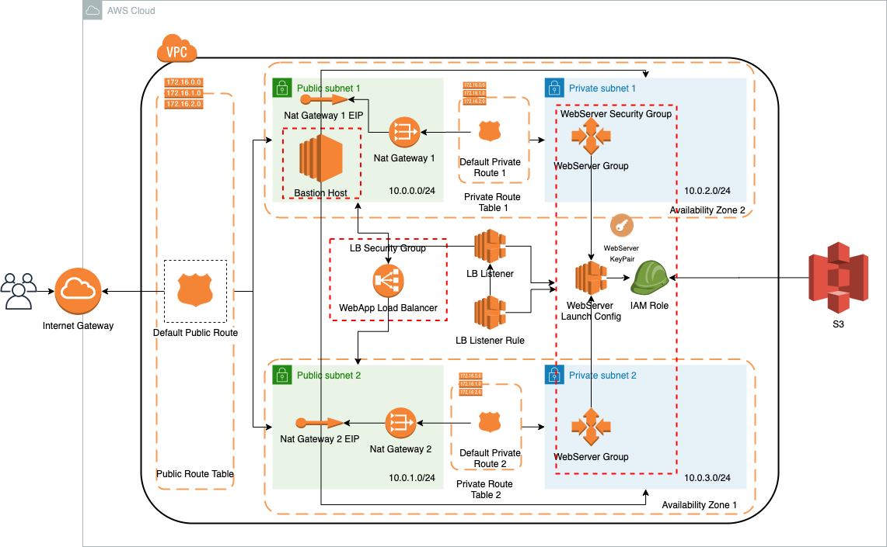

# Deploy a highly available web application using CloudFormation

## Requeriments

Your company is creating an Instagram clone called Udagram. Developers pushed the latest version of their code in a zip file located in a public S3 Bucket.

You have been tasked with deploying the application, along with the necessary supporting software into its matching infrastructure.

This needs to be done in an automated fashion so that the infrastructure can be discarded as soon as the testing team finishes their tests and gathers their results.

[Rubrics](https://review.udacity.com/#!/rubrics/2556/view)

## Architecture Diagram



## Instructions

**Prerequisites:**  
Two key pairs should be registred at aws:  
1. _AWS-IaC-WebServer_ will be used to internaly access from the _BastionHost_ to the _WebServers_  
2. _AWS-IaC-BastionHost_ will be used to externaly access from the _Internet_ to the _BastionHost_  

First step is to create the network infrastrucure by running:  
`./create.sh AWS-IaC-Network ./network/infra.yml ./network/parameters.json`

Once the network stack is created, the servers infraestructure can be created by running:  
`./create.sh AWS-IaC-Servers ./servers/infra.yml ./servers/parameters.json`

A BastionHost could be created in order to access to webservers via ssh
`./create.sh AWS-IaC-Bastion ./bastion/infra.yml ./bastion/parameters.json`

This last step is optional and the stack could be deleted once the debugging is finished with no offect on the rest of the architecure

## Misc scripts

### Network

```
./create.sh AWS-IaC-Network ./network/infra.yml ./network/parameters.json
./update.sh AWS-IaC-Network ./network/infra.yml ./network/parameters.json
./delete.sh AWS-IaC-Network
```

### Servers

```
./create.sh AWS-IaC-Servers ./servers/infra.yml ./servers/parameters.json
./update.sh AWS-IaC-Servers ./servers/infra.yml ./servers/parameters.json
./delete.sh AWS-IaC-Servers
```

### Bastion

```
./create.sh AWS-IaC-Bastion ./bastion/infra.yml ./bastion/parameters.json
./update.sh AWS-IaC-Bastion ./bastion/infra.yml ./bastion/parameters.json
./delete.sh AWS-IaC-Bastion
```

### ssh

```
chmod 400 ./AWS-IaC-BastionHost.pem
scp -i ./AWS-IaC-BastionHost.pem ./AWS-IaC-WebServer.pem ubuntu@<bastion-public-ip>:/home/ubuntu
ssh -i ./AWS-IaC-BastionHost.pem ubuntu@<bastion-public-ip>
ssh i ./AWS-IaC-WebServer.pem ubuntu@<server-private-ip>
```
